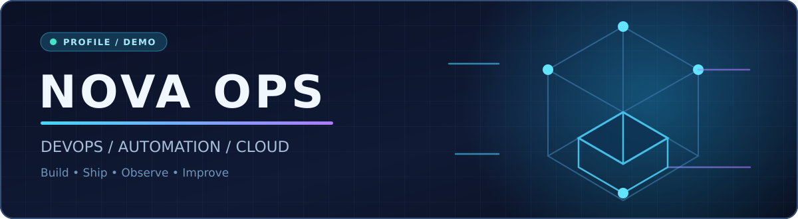
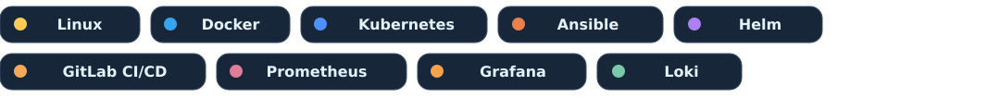
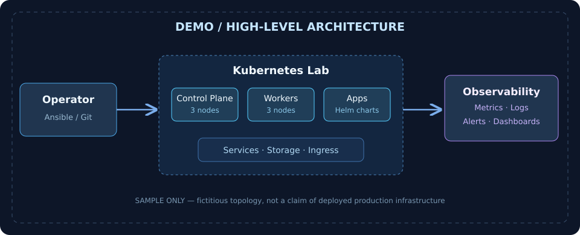

  

  <strong>🇬🇧 English</strong> &nbsp;·&nbsp; <a href="README_RU.md">🇷🇺 Русский</a>

  <b>Infrastructure • Automation • Containers • Observability</b> 
  Learning in public. Documenting every experiment. Turning labs into reproducible projects.

> [!NOTE]
> **Portfolio template with fictional data.** The alias, projects, and project details below are placeholders for visual evaluation. Replace them with verified personal work before publishing as your portfolio.

## 👋 About this profile

Hey! I'm **NOVA** (demo alias), an infrastructure enthusiast exploring how systems are deployed, operated, and monitored. I prefer practical labs with reproducible instructions, architecture diagrams, and honest notes about failures and fixes.

## 🧰 Tech stack

## 🚀 Featured projects

| Project | What it demonstrates | Stack |
|:--|:--|:--|
| **[Nebula K8s Lab](#nebula-k8s-lab)** | A fictional six-node Kubernetes learning environment, provisioned with Ansible | Kubernetes · Ansible · Helm |
| **[Signal Observatory](#signal-observatory)** | A demonstration monitoring and logging pipeline | Prometheus · Grafana · Loki |
| **[Pipeline Garage](#pipeline-garage)** | Example automated build, test and container publishing workflow | GitLab CI/CD · Docker |
| **[Infra Notebook](#infra-notebook)** | Practical notes about Linux, networking and troubleshooting | Linux · Bash |

### Nebula K8s Lab

- **Goal:** Document a repeatable control-plane and worker deployment (demo scenario).
- **Example topology:** 3 control-plane + 3 workers.
- **Artifacts to add later:** inventories, playbooks, verification output, troubleshooting notes.

### Signal Observatory

- **Goal:** Explore the path from an application event to a dashboard and alert.
- **Example pipeline:** application → metrics/logs → Prometheus/Loki → Grafana.
- **Artifacts to add later:** dashboards, alert rules, screenshots.

### Pipeline Garage

- **Goal:** Learn a clear CI/CD sequence.
- **Example stages:** lint → test → build → scan → publish.
- **Artifacts to add later:** real pipeline YAML, logs, pipeline badges.

### Infra Notebook

- **Goal:** Collect clear reproducible notes on Linux and networking practice (sample content).
- **Artifacts to add later:** configuration examples, diagnostic commands, screenshots.

## 📝 How I document projects

1. **Context:** problem and intended architecture.
2. **Deployment:** steps to reproduce and configuration.
3. **Validation:** what was checked and what happened.
4. **Troubleshooting:** errors, investigation, and fixes.

---

🧪 DEMO TEMPLATE · No real identity, real statistics, or production claims included

